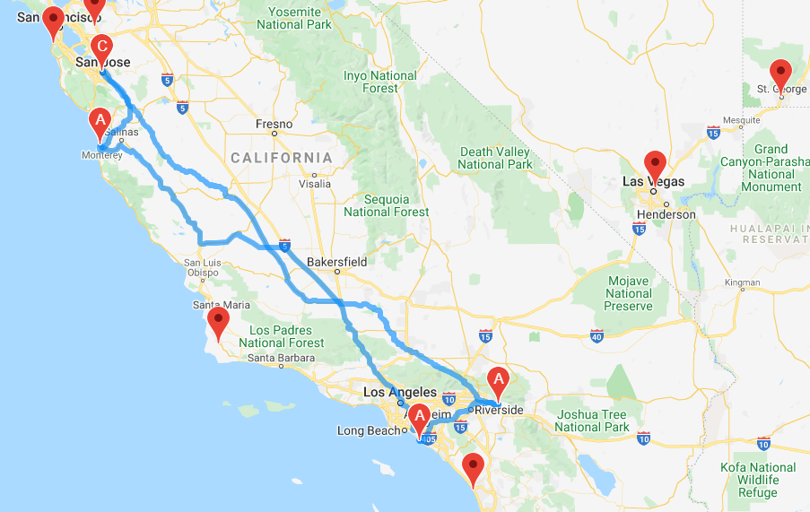

# World_Weather_Analysis
The purpose of this project was to plan a vacation trip to mild weather destinations within driving range from the San Francisco Bay area. 
This research was conducted with the help of APIs and coding!
With these awesome technologies, not only was I able to find the ideal driving destinations but also figured out good hotels to stay and as a plus, I also know what the weather looks like on these super cool spots. So I better hurry before winter kicks in and it is too late for me to still use my Fall gear and wardrobe :-)

In case you wonder, here is where I'm going to enjoy my days off:

